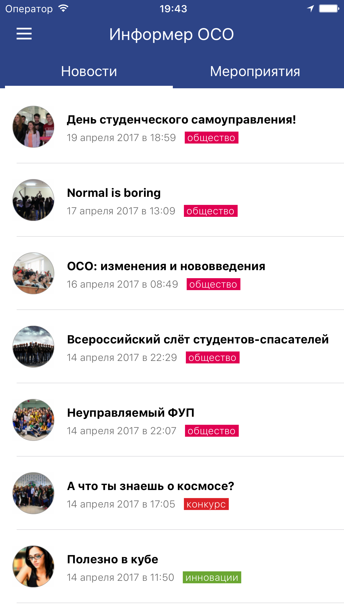
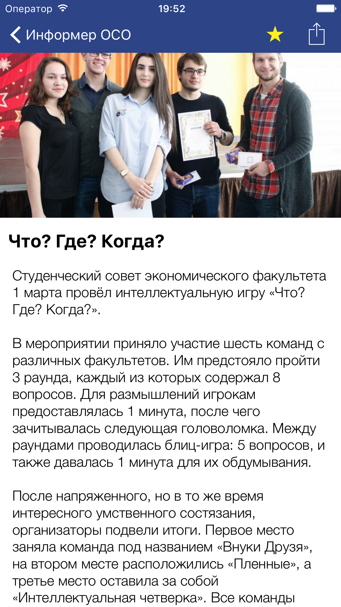
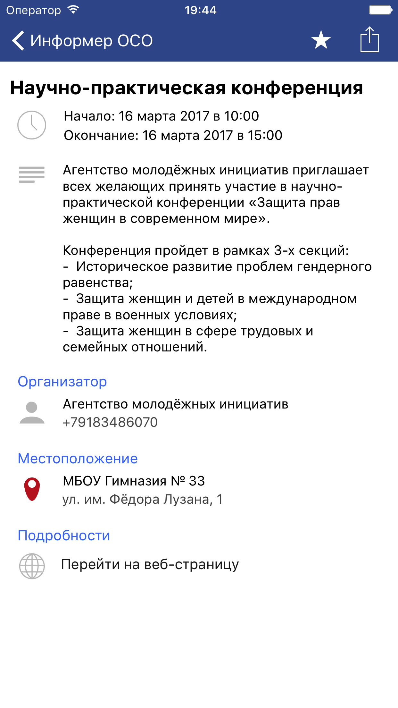

# Kubsu News iOS
Author: Tran Giang Long

`Kubsu News` is a mobile application for checking local news at Kuban State University, Russia. The students can look for latest news and exciting upcoming events. The application is aimed to orient first-year students and help them connect with their peers. The project was funded by the university and lasted 2 months.

The application was developed for iOS devices. The primary language is Objective-C and the architecture is MVC. The UI was designed in xib file.

## Features:
- Fetch local news
- Fetch upcoming events
- Show detailed view for events 
- Save to calendar
- Add events to bookmarks
## How to run
1. Clone the project into local computer
2. Open with xcode
3. Select device and run
## Screenshots

| | |
:-------------------------:|:-------------------------:
 |  
 | 